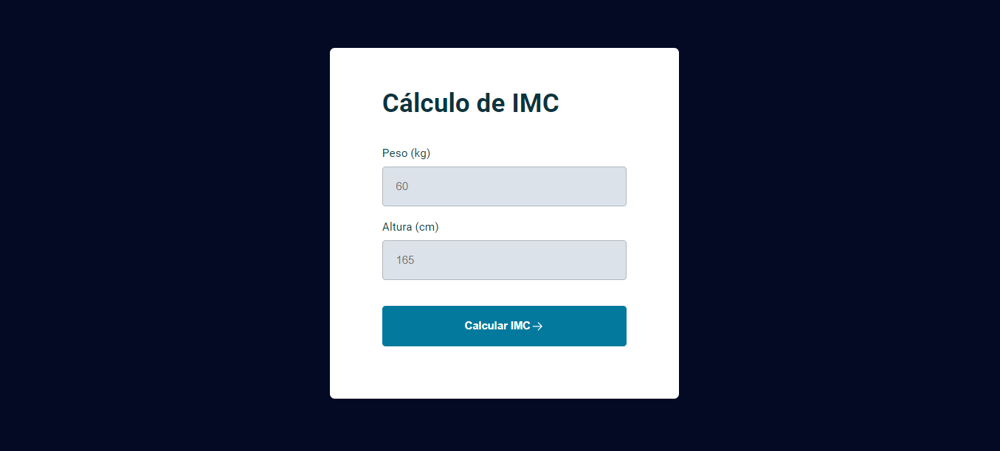
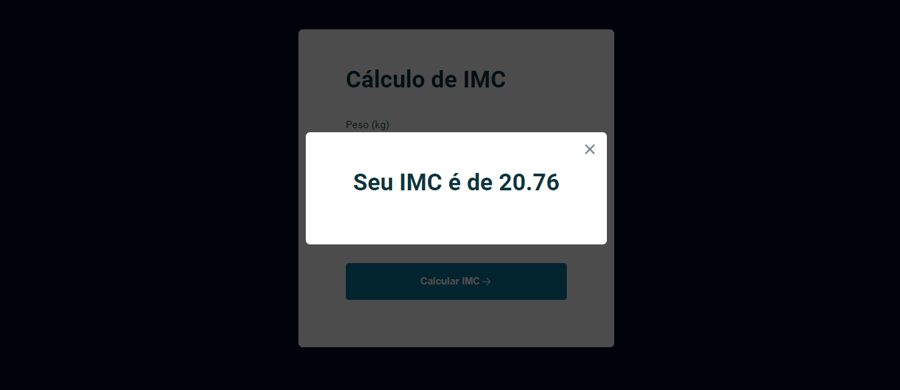

# 🔢 Calculadora de índice de massa corporal que desenvolvi aplicando meus aprendizados de Javascript (Stage 5: avançando na DOM)

## 🚀 Aplicando conhecimentos como:
- Funções e objetos 
- Ternário e operadores condicionais
- módulos import e export.
- Document Object Model

## 👁 Visão geral do projeto
> Tela inicial

> error

> popup com o resultado
